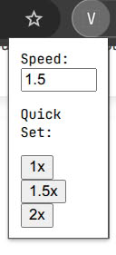

# Video Speed Controller Chrome Extension
## 🤖 All codes are generated with O1 model 🤖


A simple Google Chrome extension that sets HTML5 video and audio playback to a user-defined speed (default: **2x**). Works on **all websites** containing `<video>` or `<audio>` elements.

## Features

- **Global** support for HTML5 videos and audio on any site.
- **Configurable** speed via the extension's popup (default is 2x).
- **Persistent** across sessions (saves your chosen speed in Chrome's storage).
- **Auto-apply** playback speed whenever a new video or audio element is added (thanks to a MutationObserver).

## Folder Structure

```
.
├─ manifest.json
├─ popup.html
├─ popup.js
└─ content.js
```

- **manifest.json**  
  Defines extension metadata, permissions, and configurations.

- **popup.html**  
  The HTML for the extension’s popup window, displayed when the user clicks the extension icon.

- **popup.js**  
  Handles the logic behind the popup (loading/saving settings and sending messages to content scripts).

- **content.js**  
  The content script injected into each webpage that sets (and updates) the playback speed of all HTML5 videos.

## Installation

1. **Download** or **clone** this repository to your local machine.

2. In Google Chrome, open:
   ```
   chrome://extensions/
   ```
3. **Enable Developer Mode** by toggling it in the top-right corner.
4. Click the **“Load unpacked”** button and select the `video-speed-controller/` folder containing the files shown above.
5. Once loaded, the extension should appear in the Extensions list.

## Usage

1. **Default speed** is 2x. Any `<video>` or `<audio>` element on pages you visit will automatically start playing at 2x speed.
2. **Change speed**:
   - Click the extension icon in your Chrome toolbar.
   - In the popup, you’ll see a numeric field labeled “Playback Speed.” 
   - Enter a new speed (e.g., `1.5` or `3`) and press **Enter** or leave the field.
   - The new speed is applied instantly to all videos and audio on the current page and is remembered for all future pages.

## Notes

- This extension relies on the **Chrome Storage Sync** API to store your preferred playback speed across browser sessions.
- A **MutationObserver** is used to detect when new video or audio elements are added or replaced on modern web pages, ensuring your chosen speed is reapplied if new media appears.

## Contributing

- Feel free to open an issue or submit a pull request if you have suggestions or want to add new features.
- This project is intended as a simple example. You can modify or extend it to suit your specific use cases.

## License

This project is provided under the **MIT License**.

--- 

